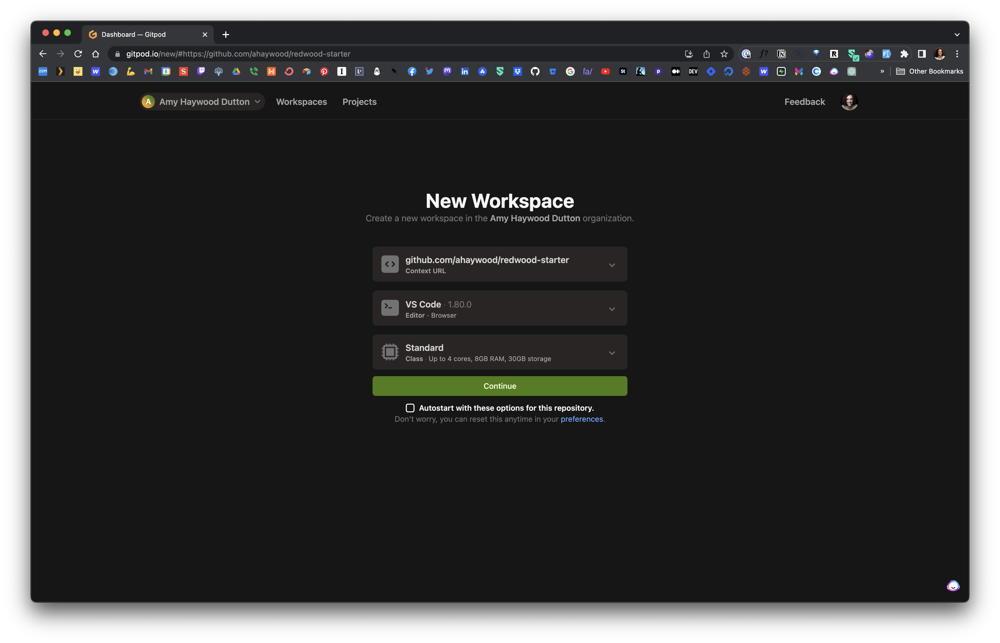
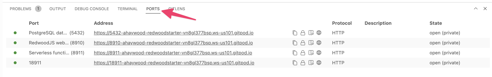
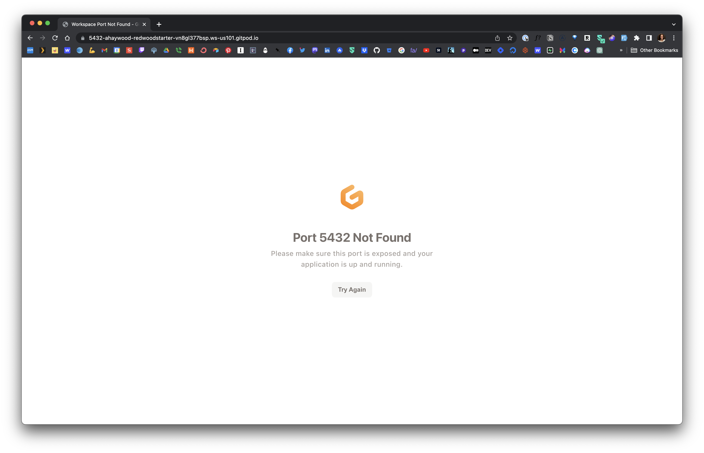
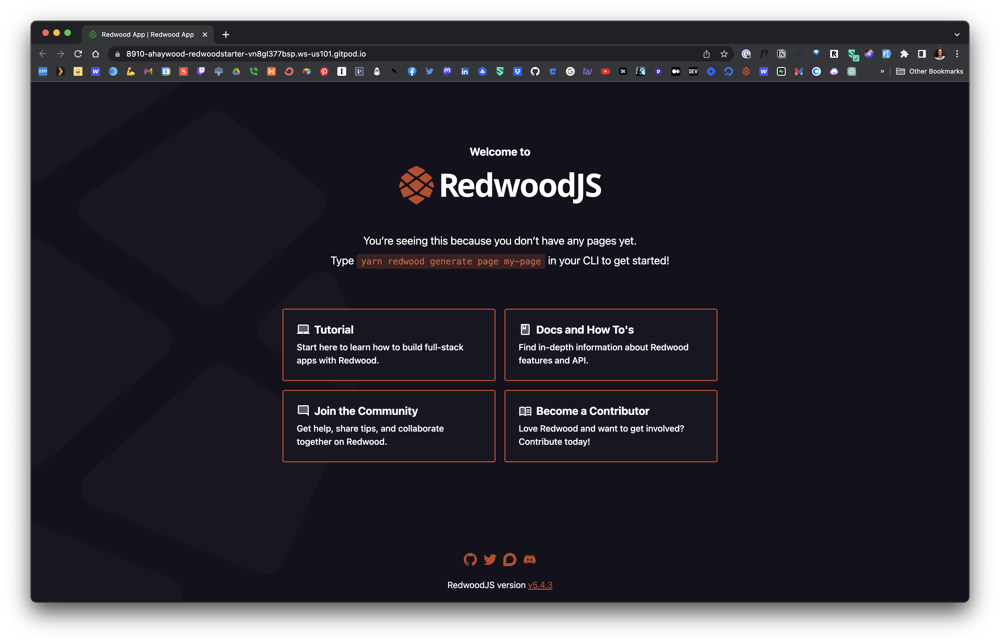
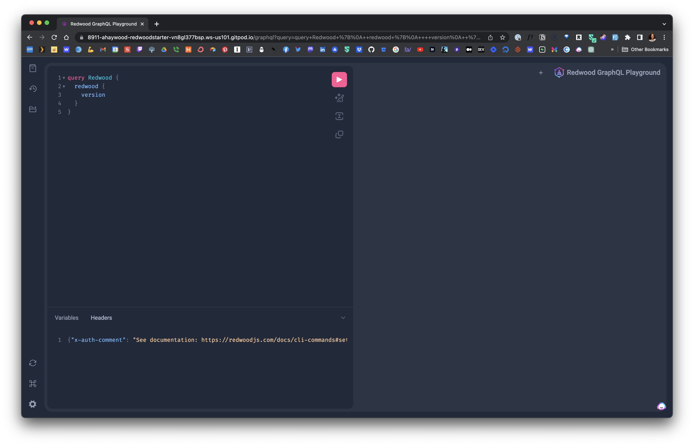

[](https://gitpod.io/#https://github.com/ahaywood/redwood-starter)

# RedwoodJS GitPod Starter

This repository enables you to easily launch [RedwoodJS](https://redwoodjs.com/) projects inside GitPod. RedwoodJS is a full-stack JavaScript framework that combines React, GraphQL, Prisma, Jest, and Storybook to build modern web applications. With this starter, setting up a RedwoodJS development environment in GitPod becomes a straightforward process. It provides a preconfigured development environment with all the necessary tools and dependencies, allowing you to focus on building your RedwoodJS application without worrying about the setup. Get started quickly and efficiently by launching RedwoodJS inside GitPod!

## Getting Started

Click on the Open in Gitpod button.

[](https://gitpod.io/#https://github.com/ahaywood/redwood-starter)

This will launch GitPod and ask you to configure a new workspace. Click continue.



GitPod will then begin to build your workspace. This may take several minutes.

What's going on behind the scenes:

- GitPod is setting the workspace set up
- It installs our recommended VS Code plugins:
  - [ESLint]()
  - [Git Lens]()
  - [VS Code Language - Babel]()
  - [VS Code Version Lens]()
  - [Editor Config]()
  - [Prisma]()
  - [VS Code GraphQL]()
- It runs our **Create Redwood App** which will install the latest stable version of Redwood. We're setting this project to use TypeScript, however, you can [change it to JavaScript]() if you prefer.
- It runs `yarn install`, adding all the dependencies for the project
- Changes the database to a postgres database

Once everything is up and running, you can click on the **Ports** tab



You can click on the address or the globe icon to open that particular port in a new tab.

- Port 5432 is the database. So, if you click on that port, you'll probably see a "Port 5432 Not Found" error, but it is working!
  
- Port 8910 is your frontend
  
- Port 8911 is your backend and will show you a list of all available functions. If you add `/graphql` to the end of the URL, you should see the GraphQL Playground
  

## Restarting the Workspace

If you need to restart the dev server, you can't just run `yarn rw dev`, you'll run into an "Invalid Host File" error.

Since we’re running in a cloud workspace, URLs like `localhost:3000` should be converted to something like `3000-abc-123.ws-eu0.gitpod.io.` ([Additional documentation](https://www.gitpod.io/guides/gitpodify#invalid-host-header).)

The following command allows us to forward the `--client-web-socket-url` to the GitPod URL.

```bash
yarn rw dev --fwd="--client-web-socket-url=ws$(gp url 8910 | cut -c 5-)/ws"
```

# The Starting Files, within this Repository

## .gitpod.yml

This contains the bulk of the GitPod setup. We're using the `gitpod/workspace-postgres` image.

Then, we're running a couple of tasks to initialize the workspace:

Create Redwood app, using feature flags to specify preferences.

```bash
yarn create redwood-app . --overwrite --yarn-install --typescript --git-init=false
```

Then, we're running the script inside `gitpod-setup.js`.

We've specified several ports:

- `5432` for Postgres
- `8910` for the frontend
- `8911` for the backend

Lastly, we've listed 8 recommended VS Code extensions to install.

## .gitpod.env

This file lists initializes the environment variables for the workspace.

```text
DATABASE_URL=""
TEST_DATABASE_URL=""
PRISMA_HIDE_UPDATE_MESSAGE=""
```

## gitpod-setup.js

This is a custom script that goes into the `app/db/prisma.schema` and changes the default SQLite database to a Postgres database.
